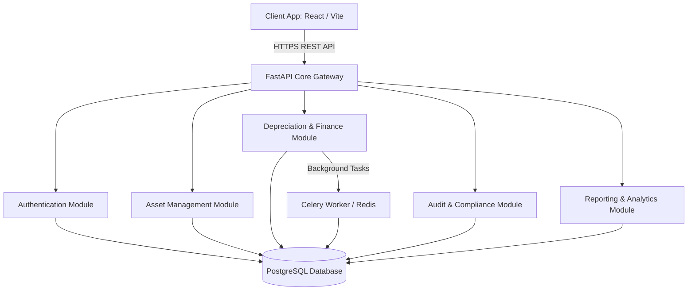

# Complete Software Architecture: AssetFlow ERP

This document outlines the software architecture for the **AssetFlow ERP** system. Designed as an enterprise-grade asset management platform, AssetFlow uses a **Modular Monolith** architecture style that maintains high separation of concerns, enabling individual business modules to be refactored into microservices if scaling demands dictate.

---

## 1. System Overview & Context

AssetFlow ERP manages the complete lifecycle of enterprise physical and digital assets, including acquisition, tracking, maintenance, depreciation calculation, audit scheduling, and compliance reporting. 



---

## 2. Architectural Style: Modular Monolith

To avoid the operational overhead of microservices in the early stages while retaining their architectural benefits (independent scaling, clean boundaries), AssetFlow implements a **Modular Monolith** pattern.

### Key Characteristics
1. **Module Isolation**: Each domain module (e.g., Assets, Depreciation, Auditing) has its own folder structure containing its respective API routers, business services, repositories, and schemas.
2. **Database Schema Separation**: Inside PostgreSQL, modules are logically grouped using schemas or distinct table prefixes (e.g., `auth_*`, `asset_*`, `finance_*`, `audit_*`).
3. **Decoupled Inter-Module Communication**: Modules communicate with each other through well-defined service contracts (Dependency Injection interfaces) or asynchronously via an event-bus, preventing spaghetti dependencies.

---

## 3. Clean Architecture: Layered Directory Structure

Each module is structured according to **Clean Architecture** principles to separate business logic from external frameworks, databases, and delivery mechanisms (APIs).

```
[API Layer: Routers & Controllers] (FastAPI Routes)
             ↓ (Validates requests using Pydantic)
[Business Logic Layer: Services & Use Cases] (Pure Python)
             ↓ (Executes transactions, applies domain rules)
[Data Access Layer: Repositories] (SQLAlchemy Database Access)
             ↓ (Encapsulates raw queries and schema mappings)
[Domain Model Layer: Entities] (SQLAlchemy Models)
```

### 3.1 Domain Model Layer (Entities)
Contains pure data models and SQLAlchemy mappings. It defines the structure of database tables, relationships, and constraints. This layer has **no dependencies** on outer layers.

### 3.2 Data Access Layer (Repositories)
The Repository Pattern decouples business logic from SQLAlchemy. Repositories handle database querying, inserts, updates, and transactions. If we transition to a different ORM or database engine, only the repository layer needs to change.

### 3.3 Business Logic Layer (Services)
The core of AssetFlow ERP. Services coordinate business processes, execute domain calculations (e.g., Straight-Line and Double Declining Balance depreciation), evaluate user permission levels, and orchestrate transactions.

### 3.4 API Delivery Layer (Routers & Controllers)
FastAPI endpoints that listen to HTTP requests, validate input payloads using Pydantic schemas, invoke the appropriate Services, and return JSON responses. This layer manages HTTP-specific logic (status codes, headers, cookies).

---

## 4. Cross-Cutting Architecture Concerns

### 4.1 Dependency Injection
AssetFlow heavily leverages FastAPI's Dependency Injection (`Depends`) to pass repositories to services, services to routers, and database sessions to repositories. This promotes:
- **Testability**: Easily mock repositories or database connections during unit tests.
- **Flexibility**: Swap out implementations at runtime (e.g., MockEmailService vs SMTPRealEmailService).

### 4.2 Database Transaction Management
Transactions are managed at the **Service Layer** using the Unit of Work pattern or context managers (`db.begin()`). This ensures that multi-step operations (e.g., transferring an asset and writing to the audit log) succeed or fail as a single atomic transaction.

### 4.3 Async vs Sync Processing
- **Sync/Blocking Work**: Standard REST requests (viewing an asset, authenticating a user) are executed synchronously or leveraging FastAPI's non-blocking async loops.
- **Async Workers**: Resource-intensive tasks (generating large PDF inventory reports, executing monthly depreciation runs, sending bulk email digests) are offloaded to **Celery workers** backed by **Redis** as a message broker.
