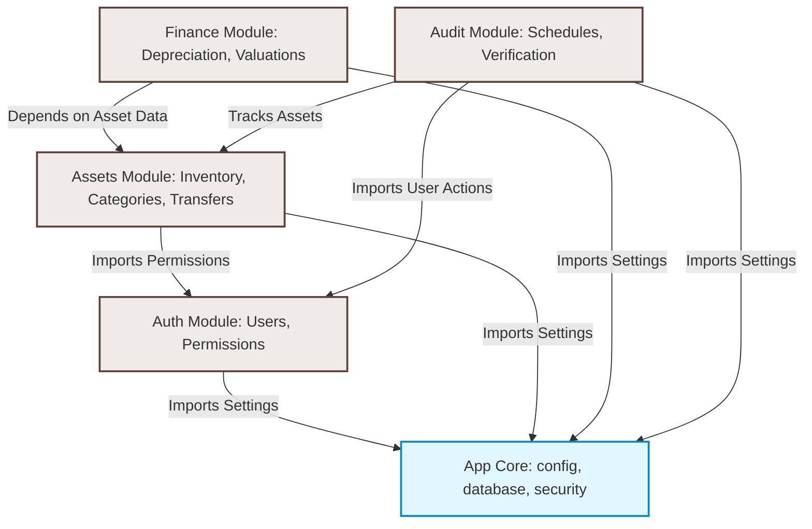

# Module Dependency Diagram: AssetFlow ERP

This document maps out the system components and module-to-module dependencies of the **AssetFlow ERP** backend. It guarantees that our Modular Monolith maintains a strict directed acyclic graph (DAG) of dependencies, preventing circular relationships and spaghetti imports.

---

## 1. System Module Dependency Graph

The diagram below details the import directions and boundaries between modules. 



---

## 2. Dependency Rules & Enforcement

To preserve module isolation, AssetFlow enforces the following design guidelines:

### 2.1 The Directed Acyclic Graph (DAG) Rule
No circular references. For example:
- **Correct**: The `Finance` module imports classes or schemas from the `Assets` module to run depreciation computations.
- **Incorrect**: The `Assets` module imports `Finance` modules to display values. If the assets interface needs current financial values, the router layer coordinates this by requesting data from the finance service, or we use standard database views.

### 2.2 Communication Channels
1.  **Direct Class Imports**: Permitted ONLY from a lower-dependency layer to a higher-dependency layer (e.g., `Audit` importing `AssetRepository`).
2.  **Service Interfaces**: For complex logic, modules call each other's exposed Service classes. We register services via FastAPI's Dependency Injection (`Depends`) to make replacement and unit-testing simple.
3.  **Database Views / Queries**: If a reporting operation requires combining data from both Assets and Audits, we write a database view or join, encapsulated within a custom repository under `reports/`.

---

## 3. Core Framework Dependency Layout

Each module follows a strict internal layer access protocol:

```
           [Route Layer]
                 │
                 ▼
          [Service Layer]
            /         \
           ▼           ▼
   [Repository]     [Schemas / Helpers]
        │
        ▼
   [DB Models]
```

-   **Models** cannot reference **Repositories** or **Services**.
-   **Repositories** can only query database models. They return Python domain model schemas or raw objects.
-   **Services** coordinates transactional databases, processes calculations, and references repositories.
-   **Routers** handle requests, call services, and handle JSON mappings. They contain no SQL queries.
