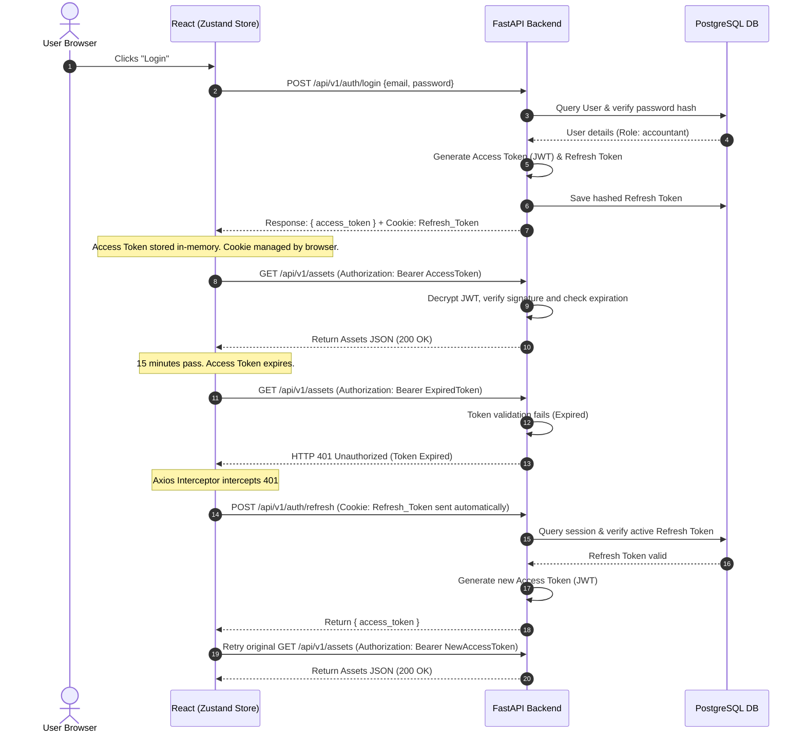

# Authentication Flow: AssetFlow ERP

This document describes the security protocols, token designs, and sequential workflows used to authenticate clients and users in **AssetFlow ERP**.

---

## 1. Authentication Topology

AssetFlow ERP implements a **stateless JWT (JSON Web Token)** authentication system, paired with a secure token-refresh pattern to balance security and user convenience.

```
       [Client Browser]                         [FastAPI Server]
              │                                         │
              │ 1. POST /login (Credentials)            │
              ├────────────────────────────────────────>│
              │                                         │ (Verify Password)
              │ 2. Return Access Token & Refresh Cookie │
              |<────────────────────────────────────────┤
              │                                         │
              │ 3. GET /assets (with Access Token)      │
              ├────────────────────────────────────────>│ (Verify JWT Signature)
              │                                         │
              │ 4. Respond with Asset JSON Data         │
              |<────────────────────────────────────────┘
```

---

## 2. Token Designs & Lifecycles

To defend against Cross-Site Scripting (XSS) and Session Hijacking:

### 2.1 Access Token (Short-Lived)
*   **Format**: JWT
*   **Lifetime**: 15 Minutes
*   **Delivery**: Sent in the HTTP Authorization header (`Authorization: Bearer <Access_Token>`). Stored in memory (React state) to prevent persistent storage XSS vectors.
*   **Payload structure**:
    ```json
    {
      "sub": "user-uuid-1234",
      "email": "accountant@assetflow.com",
      "role": "accountant",
      "exp": 1783857600
    }
    ```

### 2.2 Refresh Token (Long-Lived)
*   **Format**: Secure Cryptographic String
*   **Lifetime**: 7 Days
*   **Delivery**: Returned to the client as an `HttpOnly`, `Secure`, and `SameSite=Strict` cookie. This makes it inaccessible to client-side JavaScript, protecting it against XSS theft.
*   **Storage**: A hashed representation of the refresh token is stored in the PostgreSQL database against the user record to allow instant revocation.

---

## 3. Detailed Token Exchange Sequence

The following diagram maps how the React frontend handles access token expiration and transparently triggers token renewal:



---

## 4. Revocation & Logout Flow

When a user logs out:
1.  The client sends a `POST /api/v1/auth/logout` request.
2.  The backend clears the database's cached refresh token record for that user ID, rendering the old cookie useless.
3.  The backend returns an expired Refresh Token cookie header to command the browser to delete the cookie immediately.
4.  The React app clears its local memory storage and redirects the user to the Login page.
