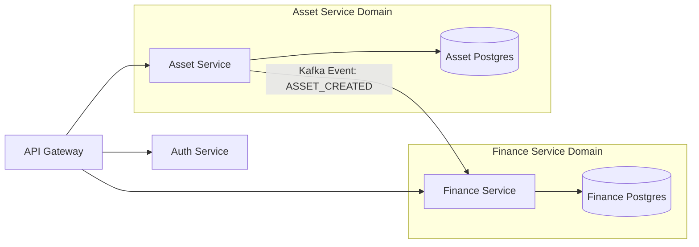

# Future Scalability Plan: AssetFlow ERP

This plan outlines the technological roadmap to scale **AssetFlow ERP** from a single instance supporting thousands of assets to an enterprise-grade platform managing millions of assets across multiple organizational divisions.

---

## 1. Short-Term Scaling: Optimization & Caching (10K - 100K Assets)

Focuses on maximizing existing monolithic performance before adding infrastructure complexity.

### 1.1 Database Connection Pooling (PgBouncer)
*   **Problem**: Establishing a new TCP connection to PostgreSQL on every HTTP request takes 20-50ms, limiting throughput.
*   **Solution**: Introduce **PgBouncer** between FastAPI and Render PostgreSQL. Set PgBouncer to **Transaction Mode** to share a pool of 50-100 real connections among thousands of client requests.

### 1.2 Redis Query Caching
*   **Dashboard Statistics**: Cache complex aggregation queries (e.g., total asset value, category counts) for 15 minutes.
*   **Asset Catalog Reads**: Cache single active assets (`GET /api/v1/assets/{id}`) with write-through invalidation (evict cache on `PATCH` or `DELETE` commands).

---

## 2. Medium-Term Scaling: Data & Read Separation (100K - 1M Assets)

Focuses on resolving database bottlenecks as read and write traffic rises.

### 2.1 Read/Write Database Replicas
Configure SQLAlchemy to route database traffic dynamically based on operation type:
*   **Primary DB Instance**: Handles all write transactions (`POST`, `PUT`, `PATCH`, `DELETE`).
*   **Read-Only Replicas**: Distribute get queries (`GET /api/v1/assets`) across 1 or more replica databases, reducing load on the primary node.

```
                  [FastAPI API Nodes]
                     /           \
         (Writes)   /             \   (Reads)
                   ▼               ▼
            [Primary DB] ───> [Read Replicas]
```

### 2.2 Table Partitioning (PostgreSQL)
For high-volume transactional logs like `depreciations` and `asset_transfers`, implement PostgreSQL declarative partitioning:
*   **Partition Key**: Partition by `calculation_date` or `fiscal_year`.
*   **Benefit**: Queries searching for specific fiscal years bypass 90% of the database file, containing search ranges and preventing full-table scan slowdowns.

---

## 3. Long-Term Scaling: Microservices Transformation (1M+ Assets)

When cross-team velocity or independent execution boundaries require decoupling, the Modular Monolith is split into independent services.



### 3.1 Step 1: Separate Databases
*   Move each module's tables into dedicated PostgreSQL physical instances.
*   Enforce communication strictly via HTTP/gRPC APIs. Avoid cross-database SQL joins.

### 3.2 Step 2: Event-Driven Architecture (Kafka / RabbitMQ)
*   Transition from synchronous service calls to asynchronous event publishing.
*   **Example**: When a user registers a new asset in the Asset Service, it broadcasts an `ASSET_CREATED` event to **Apache Kafka**. The Finance Service reads this event and automatically builds a depreciation schedule skeleton.
