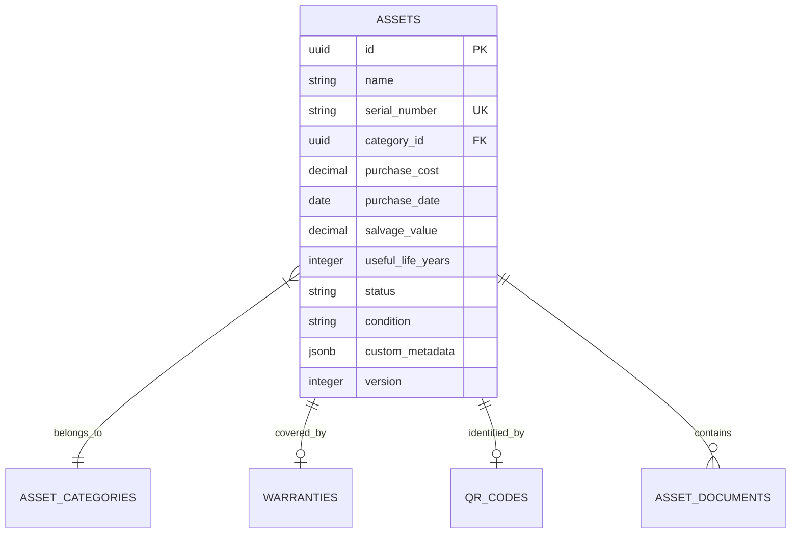

# Asset Engine Database Design: AssetFlow ERP

This document details the database schema, table mappings, validation checks, and index strategies for the **Asset Management Engine**.

---

## 1. Schema Mappings & Tables

To support unstructured custom properties alongside structured records, the `assets` table uses a PostgreSQL **JSONB** column for metadata.



---

## 2. Table Mappings (SQLAlchemy Code Blueprint)

```python
# app/modules/assets/models.py
from sqlalchemy import Column, String, Numeric, Date, Integer, ForeignKey, JSON
from sqlalchemy.dialects.postgresql import UUID, JSONB
from sqlalchemy.orm import relationship
from app.models.base import Base, AuditMixin

class Asset(Base, AuditMixin):
    __tablename__ = "assets"
    
    name = Column(String(255), nullable=False)
    serial_number = Column(String(100), unique=True, nullable=False, index=True)
    category_id = Column(UUID(as_uuid=True), ForeignKey("asset_categories.id", ondelete="RESTRICT"), nullable=False)
    purchase_cost = Column(Numeric(15, 2), nullable=False)
    purchase_date = Column(Date, nullable=False)
    salvage_value = Column(Numeric(15, 2), default=0.00, nullable=False)
    useful_life_years = Column(Integer, nullable=False)
    
    # Custom metadata properties support using PostgreSQL JSONB
    custom_metadata = Column(JSONB, default={}, nullable=False)
    
    # Relationships
    category = relationship("AssetCategory", back_populates="assets")
    warranty = relationship("Warranty", uselist=False, back_populates="asset", cascade="all, delete-orphan")
    qr_code = relationship("QRCode", uselist=False, back_populates="asset", cascade="all, delete-orphan")
    documents = relationship("AssetDocument", back_populates="asset", cascade="all, delete-orphan")
```

---

## 3. Database Constraints

We enforce data integrity checks directly in the database:

1.  **Unique Constraint**: `uq_assets_serial_number` ON (`serial_number`).
2.  **Cost Validation Constraint**:
    ```sql
    ALTER TABLE assets ADD CONSTRAINT chk_purchase_cost CHECK (purchase_cost > 0.00);
    ```
3.  **Salvage Value Constraint**:
    ```sql
    ALTER TABLE assets ADD CONSTRAINT chk_salvage_value CHECK (salvage_value <= purchase_cost AND salvage_value >= 0.00);
    ```
4.  **Useful Life Constraint**:
    ```sql
    ALTER TABLE assets ADD CONSTRAINT chk_useful_life CHECK (useful_life_years >= 1);
    ```

---

## 4. Indexing Strategy

To keep query performance under 10ms for active records:

*   **B-Tree Index on Serial Number**:
    ```sql
    CREATE UNIQUE INDEX idx_assets_serial_active ON assets (serial_number) WHERE is_deleted = FALSE;
    ```
*   **GIN Index on Custom Metadata**:
    ```sql
    CREATE INDEX idx_assets_metadata_gin ON assets USING gin (custom_metadata);
    ```
    *   *Usage*: Speeds up searches on custom key-value pairs (e.g., searching for laptops with `{"ram_size": "16GB"}`).
*   **Composite Index for Categories & Status**:
    ```sql
    CREATE INDEX idx_assets_cat_status ON assets (category_id, status);
    ```
