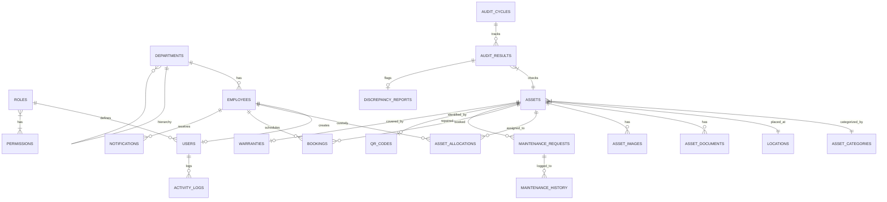

# Relationship Model & ERD: AssetFlow ERP

This document maps the entity relationship model, constraints, cascade deleting strategies, soft delete designs, and optimistic lock versioning rules for **AssetFlow ERP**.

---

## 1. Entity-Relationship Diagram (ERD)



---

## 2. Cardinality Mapping & Constraints

### 2.1 One-to-One Relationships
1.  **`users` <-> `employees`**: A user account maps to exactly one physical employee record.
2.  **`assets` <-> `qr_codes`**: Each physical asset possesses one unique QR code string.
3.  **`assets` <-> `warranties`**: An asset has at most one warranty timeline record.
4.  **`bookings` <-> `booking_resources`**: Bookings for rooms map to exactly one resource capacity check.
5.  **`audit_results` <-> `discrepancy_reports`**: A verified check discrepancy references exactly one audit result row.

### 2.2 One-to-Many Relationships
1.  **`departments` <-> `employees`**: A department has many employees; an employee belongs to exactly one department.
2.  **`assets` <-> `asset_allocations`**: An asset can be assigned to multiple employees over time, but only one allocation can be active (where `returned_at IS NULL`) at any given moment.
3.  **`maintenance_requests` <-> `maintenance_history`**: A request can spawn multiple history entries if repairs are done in stages.

### 2.3 Many-to-Many Relationships
1.  **`roles` <-> `permissions`**: Implemented via the `role_permissions` join table to support granular permission checking.

---

## 3. Delete & Cascade Strategy

To maintain audit logs and prevent the accidental deletion of financial records:

*   **`ON DELETE RESTRICT`**: Applied to all primary master tables.
    *   Example: A `department` cannot be deleted if active `employees` are assigned to it.
    *   Example: An `asset` record cannot be deleted if it has related `asset_allocations` or `maintenance_history` entries.
*   **`ON DELETE CASCADE`**: Applied strictly to dependent, non-financial tables.
    *   Example: Deleting an `asset` will cascade delete its `asset_images` and `asset_documents`.
    *   Example: Deleting an `audit_cycle` will cascade delete its `audit_results` and `discrepancy_reports`.

---

## 4. Soft Delete Strategy

AssetFlow does not permanently delete core records. Instead, it uses a **Soft Delete** pattern.

### Implementation Details
*   Tables like `assets`, `employees`, and `departments` contain a `status` column rather than a simple boolean flag.
*   When a user clicks "Delete", the application sets the status field (e.g., setting an asset's status to `retired` or an employee's status to `terminated`).
*   **Benefits**:
    1.  **Data Retention**: Historical records are preserved, allowing finance teams to run depreciation reports for retired assets.
    2.  **Referential Integrity**: Prevents orphan record issues without breaking database relationships.

---

## 5. Versioning & Optimistic Concurrency Control

To prevent race conditions during concurrent updates (e.g., two managers attempting to allocate the same asset simultaneously):

1.  The `assets` table contains a `version` column (Integer).
2.  When updating an asset, the update statement checks the version ID:
    ```sql
    UPDATE assets 
    SET status = 'allocated', version = version + 1 
    WHERE id = :asset_id AND version = :expected_version;
    ```
3.  If the query updates 0 rows, it indicates that another user modified the asset in the meantime. The system rolls back the transaction and returns an `HTTP 409 Conflict` error.
