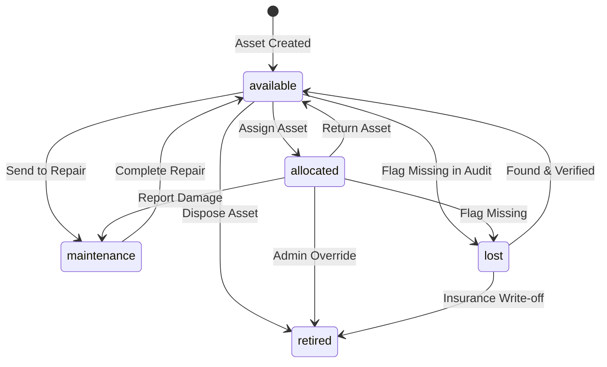

# Database Validation Strategy: AssetFlow ERP

This document outlines the data validation rules, check constraints, and state transition validation rules for **AssetFlow ERP**.

---

## 1. Field-Level Validation Constraints

We enforce validation rules at both the database layer (via SQL check constraints) and the application layer (via Pydantic schemas) to ensure data integrity:

### 1.1 Email Format Validation
*   **Database Check**: Enforces basic syntax check constraints.
    ```sql
    ALTER TABLE users ADD CONSTRAINT chk_users_email_format 
    CHECK (email ~* '^[a-z0-9._%%+-]+@[a-z0-9.-]+\.[a-z]{2,}$');
    ```

### 1.2 Phone Number Format Validation
*   **Database Check**: Enforces the E.164 international phone number format.
    ```sql
    ALTER TABLE vendors ADD CONSTRAINT chk_vendors_phone_format 
    CHECK (support_phone ~* '^\+[1-9]\d{1,14}$');
    ```
    *   **Format**: `+1234567890` (starts with a plus sign, followed by 1 to 15 digits).

### 1.3 Time & Date Range Validations
To prevent logic errors (such as booking returns occurring before acquisitions):
*   **Bookings**:
    ```sql
    ALTER TABLE bookings ADD CONSTRAINT chk_booking_dates 
    CHECK (end_time > start_time);
    ```
*   **Maintenance**:
    ```sql
    ALTER TABLE maintenance_requests ADD CONSTRAINT chk_maintenance_dates 
    CHECK (end_date >= start_date OR end_date IS NULL);
    ```

---

## 2. Asset Status Transition State Machine

To prevent invalid status changes (such as allocating a retired asset):



### Transition Enforcement Rules
*   **Validation Check**: Every update to an asset's status triggers a check inside the Asset Service layer to confirm the transition is valid:
    ```python
    ALLOWED_TRANSITIONS = {
        "available": ["allocated", "maintenance", "retired", "lost"],
        "allocated": ["available", "maintenance", "retired", "lost"],
        "maintenance": ["available", "retired"],
        "lost": ["available", "retired"],
        "retired": [] # Terminal state
    }
    
    def validate_transition(current_status: str, target_status: str):
        if target_status not in ALLOWED_TRANSITIONS[current_status]:
            raise ValueError(f"Invalid transition from {current_status} to {target_status}")
    ```
*   **Terminal States**: Assets marked as "retired" cannot transition to any other status.
