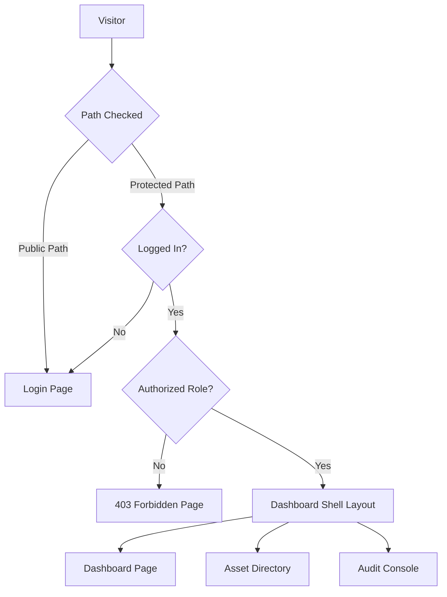

# Navigation & Journeys: AssetFlow ERP

This document maps out the application's routing structure, navigation rules, access guards, and sidebar configurations based on user roles.

---

## 1. Routing Hierarchy & Guard Logic

AssetFlow ERP implements a protected routing system using **React Router v6** with nested layouts.

### 1.1 Route Configuration Table

| Path | Layout Shell | Allowed Roles | Guard Middleware |
| :--- | :--- | :--- | :--- |
| `/login` | `AuthLayout` | Public | Redirects authenticated users to `/` |
| `/forgot-password` | `AuthLayout` | Public | Public |
| `/` | N/A | All | Redirects to `/dashboard` |
| `/dashboard` | `DashboardLayout` | All | `RequireAuth` |
| `/assets` | `DashboardLayout` | All | `RequireAuth` |
| `/assets/register` | `DashboardLayout` | `admin`, `manager` | `RequireAuth`, `RequireRole` |
| `/assets/:id` | `DashboardLayout` | All | `RequireAuth` |
| `/transfers` | `DashboardLayout` | `admin`, `manager` | `RequireAuth`, `RequireRole` |
| `/bookings` | `DashboardLayout` | All | `RequireAuth` |
| `/maintenance` | `DashboardLayout` | `admin`, `manager`, `technician` | `RequireAuth`, `RequireRole` |
| `/audits` | `DashboardLayout` | `admin`, `auditor` | `RequireAuth`, `RequireRole` |
| `/reports` | `DashboardLayout` | `admin`, `accountant` | `RequireAuth`, `RequireRole` |
| `/settings` | `DashboardLayout` | `admin` | `RequireAuth`, `RequireRole` |
| `/profile` | `DashboardLayout` | All | `RequireAuth` |

---

## 2. Dynamic Sidebar Configuration

The navigation menu adapts dynamically to the permissions of the logged-in user.

### 2.1 Admin & Manager View
*   **Overview Panel**: Dashboard, Notifications, Profile
*   **Asset Management**: Asset Catalog, Asset Registration, Locations, Categories
*   **Workflows**: Transfer Approvals, Resource Booking, Maintenance Requests
*   **Compliance**: Physical Audits, Valuation Reports, Activity Logs
*   **System Settings**: User Management, Global Configuration

### 2.2 Accountant View
*   **Overview Panel**: Dashboard, Notifications, Profile
*   **Finance Registry**: Asset Directory (Read-Only), Asset Categories
*   **Valuation**: Depreciation runs, Valuation Reports

### 2.3 Regular Employee View
*   **Overview Panel**: Dashboard, Notifications, Profile
*   **Self Service**: My Allocated Assets, Booking Calendar, Report Damage

---

## 3. Breadcrumb & Navigation Rules

To maintain user context throughout the application:
1.  **Uniform Breadcrumbs**: Nested pages dynamically generate path breadcrumbs. For example, viewing a specific asset displays `Assets / Directory / Asset Details`.
2.  **State Preservation**: Navigating away from the Asset Directory page saves the active search, filter, and scroll positions in a temporary session store, restoring them when the user returns.
3.  **Prevent Unsaved Changes**: Forms (like Asset Registration) monitor input states. If a user tries to navigate away with unsaved changes, the app displays a confirmation dialog.
