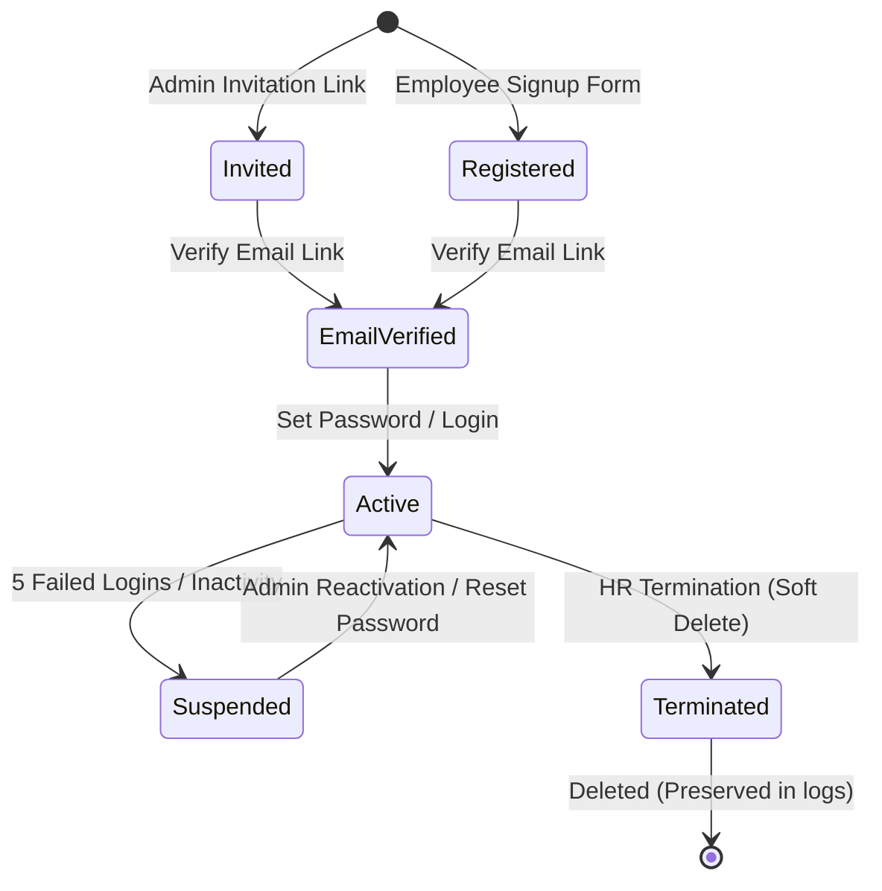
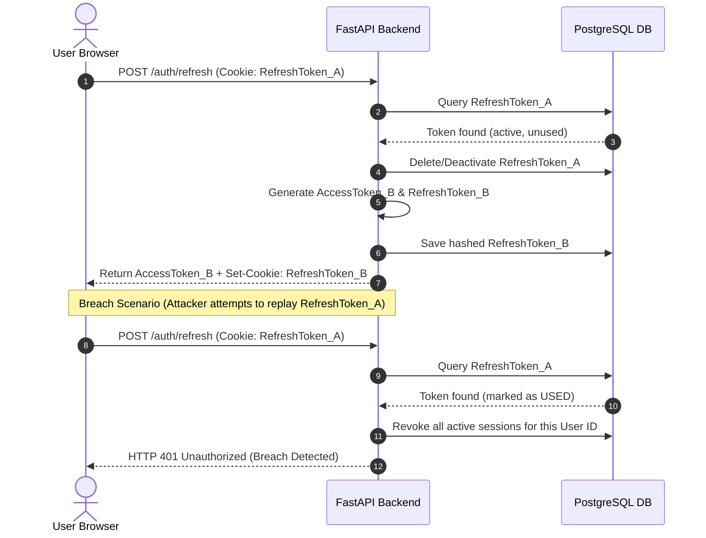

# Enterprise Authentication Blueprint: AssetFlow ERP

This document specifies the identity lifecycles, signup workflows, session revocation controls, and token rotation mechanics for **AssetFlow ERP**.

---

## 1. Identity System Lifecycle

AssetFlow handles user status transitions systematically to maintain data integrity and support corporate compliance rules.

### 1.1 Identity Lifecycle States
*   **Employee Signup**: Standard registration form. Accounts remain unverified until the employee clicks the email verification link.
*   **Admin Invitation**: Admins can invite new users (e.g., Auditors, Managers) by generating a unique registration token link.
*   **Email Verification**: Signups trigger a verification email containing a secure token that expires after 24 hours.
*   **Account Lockout**: Triggers automatically after **5 consecutive failed login attempts**. Locks the account for 15 minutes.
*   **Password Expiration**: Enforces a mandatory password change every **90 days**.

---

## 2. Session & Multi-Device Management

To monitor and secure active login sessions:

1.  **Multi-Device Tracking**: When a user logs in, the backend registers the device's IP address, User-Agent, location, and a unique session ID (`session_uuid`).
2.  **Dashboard Session List**: Users can view all active devices logged into their account from the settings panel.
3.  **Active Session Revocation**: Clicking "Logout Device" sends a `POST /api/v1/auth/sessions/{id}/revoke` request. This deletes the session record in PostgreSQL, invalidating the refresh token.

---

## 3. Token Rotation Flow Diagram

We implement **Refresh Token Rotation (RTR)**. Every time the client requests a new access token using a refresh token:
*   The backend validates the old refresh token.
*   The old refresh token is marked as used and deleted.
*   A new refresh token is issued to the client in the cookie.
*   **Breach Detection**: If a used refresh token is submitted, the system assumes a token theft has occurred, invalidates all active sessions for that user ID, and logs a critical security alert.

Using this approach, if an attacker steals a user's refresh token, it can only be used once. As soon as the victim's browser attempts to use the original token, the security breach is detected and all active sessions are terminated.
