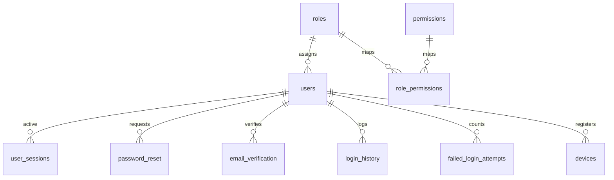

# IAM Database Design: AssetFlow ERP

This document contains the database schema, table definitions, constraints, default values, and index specifications for the **AssetFlow ERP** Identity & Access Management (IAM) module.

---

## 1. Relational Schema Blueprint

The IAM database structure consists of ten tables mapping credentials, roles, sessions, and histories.

---

## 2. Table Definitions & Constraints

### 2.1 `users`
*   **Purpose**: Main account credentials store.
*   **Columns & Types**:
    *   `id`: `UUID` (Primary Key, Default: `gen_random_uuid()`)
    *   `email`: `VARCHAR(255)` (Not Null, Lowercase)
    *   `hashed_password`: `VARCHAR(255)` (Not Null)
    *   `role_id`: `UUID` (Foreign Key, Not Null)
    *   `is_active`: `BOOLEAN` (Default: `true`)
    *   `is_verified`: `BOOLEAN` (Default: `false`)
    *   `password_changed_at`: `TIMESTAMP WITH TIME ZONE` (Default: `now()`)
    *   `created_at`: `TIMESTAMP WITH TIME ZONE` (Default: `now()`)
*   **Unique Constraints**: `uq_users_email` ON (`email`)
*   **Foreign Keys**:
    *   `fk_users_role` FOREIGN KEY (`role_id`) REFERENCES `roles` (`id`) ON DELETE RESTRICT
*   **Index Strategy**: Unique Index on `email`.

---

### 2.2 `roles`
*   **Purpose**: Roles list.
*   **Columns & Types**:
    *   `id`: `UUID` (Primary Key, Default: `gen_random_uuid()`)
    *   `name`: `VARCHAR(50)` (Not Null)
    *   `description`: `VARCHAR(255)`
*   **Unique Constraints**: `uq_roles_name` ON (`name`)

---

### 2.3 `permissions`
*   **Purpose**: Granular permissions.
*   **Columns & Types**:
    *   `id`: `UUID` (Primary Key, Default: `gen_random_uuid()`)
    *   `code`: `VARCHAR(100)` (Not Null)
    *   `description`: `VARCHAR(255)`
*   **Unique Constraints**: `uq_permissions_code` ON (`code`)

---

### 2.4 `role_permissions`
*   **Purpose**: Maps permissions to roles.
*   **Columns & Types**:
    *   `role_id`: `UUID` (Foreign Key, Primary Key Component)
    *   `permission_id`: `UUID` (Foreign Key, Primary Key Component)
*   **Foreign Keys**:
    *   `fk_rp_role` FOREIGN KEY (`role_id`) REFERENCES `roles` (`id`) ON DELETE CASCADE
    *   `fk_rp_perm` FOREIGN KEY (`permission_id`) REFERENCES `permissions` (`id`) ON DELETE CASCADE

---

### 2.5 `user_sessions`
*   **Purpose**: Tracks active login sessions and supports token rotation checks.
*   **Columns & Types**:
    *   `id`: `UUID` (Primary Key, Default: `gen_random_uuid()`)
    *   `user_id`: `UUID` (Foreign Key, Not Null)
    *   `refresh_token_hash`: `VARCHAR(255)` (Not Null, Unique)
    *   `is_revoked`: `BOOLEAN` (Default: `false`)
    *   `expires_at`: `TIMESTAMP WITH TIME ZONE` (Not Null)
    *   `created_at`: `TIMESTAMP WITH TIME ZONE` (Default: `now()`)
*   **Foreign Keys**:
    *   `fk_sessions_user` FOREIGN KEY (`user_id`) REFERENCES `users` (`id`) ON DELETE CASCADE
*   **Index Strategy**: Index on `refresh_token_hash` (for fast lookup).

---

### 2.6 `password_reset`
*   **Purpose**: Stores password reset tokens.
*   **Columns & Types**:
    *   `id`: `UUID` (Primary Key, Default: `gen_random_uuid()`)
    *   `user_id`: `UUID` (Foreign Key, Not Null)
    *   `token_hash`: `VARCHAR(255)` (Not Null, Unique)
    *   `expires_at`: `TIMESTAMP WITH TIME ZONE` (Not Null)
    *   `is_used`: `BOOLEAN` (Default: `false`)
*   **Foreign Keys**:
    *   `fk_pwreset_user` FOREIGN KEY (`user_id`) REFERENCES `users` (`id`) ON DELETE CASCADE

---

### 2.7 `email_verification`
*   **Purpose**: Stores email verification tokens.
*   **Columns & Types**:
    *   `id`: `UUID` (Primary Key, Default: `gen_random_uuid()`)
    *   `user_id`: `UUID` (Foreign Key, Not Null)
    *   `token_hash`: `VARCHAR(255)` (Not Null, Unique)
    *   `expires_at`: `TIMESTAMP WITH TIME ZONE` (Not Null)
*   **Foreign Keys**:
    *   `fk_emailverify_user` FOREIGN KEY (`user_id`) REFERENCES `users` (`id`) ON DELETE CASCADE

---

### 2.8 `login_history`
*   **Purpose**: Logs user authentication attempts for security auditing.
*   **Columns & Types**:
    *   `id`: `UUID` (Primary Key, Default: `gen_random_uuid()`)
    *   `user_id`: `UUID` (Foreign Key, Not Null)
    *   `login_at`: `TIMESTAMP WITH TIME ZONE` (Default: `now()`)
    *   `ip_address`: `VARCHAR(45)` (Not Null)
    *   `user_agent`: `VARCHAR(512)`
    *   `status`: `VARCHAR(20)` (check: 'success', 'failed')
*   **Foreign Keys**:
    *   `fk_loginhist_user` FOREIGN KEY (`user_id`) REFERENCES `users` (`id`) ON DELETE CASCADE

---

### 2.9 `devices`
*   **Purpose**: Registers authorized user devices.
*   **Columns & Types**:
    *   `id`: `UUID` (Primary Key, Default: `gen_random_uuid()`)
    *   `user_id`: `UUID` (Foreign Key, Not Null)
    *   `device_fingerprint`: `VARCHAR(255)` (Not Null)
    *   `last_active_at`: `TIMESTAMP WITH TIME ZONE` (Default: `now()`)
*   **Unique Constraints**: `uq_devices_fingerprint` ON (`user_id`, `device_fingerprint`)
*   **Foreign Keys**:
    *   `fk_devices_user` FOREIGN KEY (`user_id`) REFERENCES `users` (`id`) ON DELETE CASCADE

---

### 2.10 `failed_login_attempts`
*   **Purpose**: Tracks failed login attempts to trigger account lockout.
*   **Columns & Types**:
    *   `user_id`: `UUID` (Foreign Key, Primary Key)
    *   `attempt_count`: `INTEGER` (Default: `0`)
    *   `locked_until`: `TIMESTAMP WITH TIME ZONE` (Nullable)
*   **Check Constraints**: `chk_attempts` CHECK (`attempt_count >= 0`)
*   **Foreign Keys**:
    *   `fk_failed_user` FOREIGN KEY (`user_id`) REFERENCES `users` (`id`) ON DELETE CASCADE
