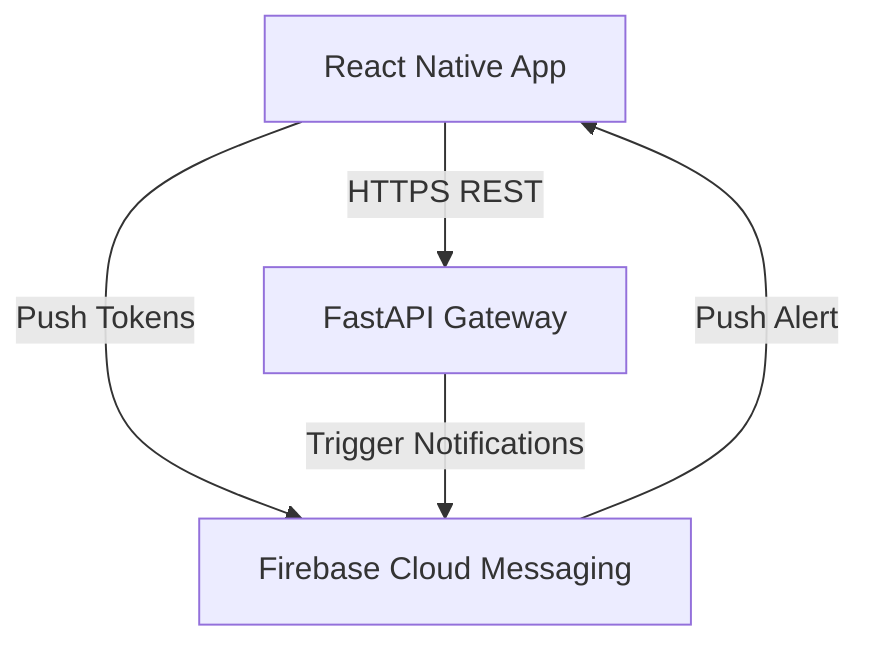

# Future Expansion Report: AssetFlow ERP

This report details the architectural plans to extend **AssetFlow ERP** beyond the core Web client and REST API. It outlines integrations with mobile platforms, IoT sensors, hardware scanning devices, and external corporate networks.

---

## 1. Mobile Application Integration

To support field audits and inventory counts, the system is designed to connect to a mobile application.



### 1.1 Mobile Stack (React Native + TypeScript)
*   **Code Reusability**: The React Native application will reuse the frontend Zustand stores, TypeScript types, and Axios client configurations.
*   **Camera Integration**: Utilizes device cameras as barcode scanners via libraries like `react-native-vision-camera`.
*   **Offline Mode**: Leverages **WatermelonDB** or **SQLite** on-device to cache asset lists. This allows field agents to complete inventory audits in offline zones (e.g., basements, warehouse floors) and sync changes back when internet access is restored.

---

## 2. Hardware Scanning Device Integrations

To speed up physical inventory tracking, AssetFlow supports direct scanning integration:

1.  **QR Code Generator**: The Asset module includes a library (e.g., `qrcode` in Python) to generate unique QR codes containing encoded asset URLs (e.g., `https://assetflow.com/assets/uuid-v4-key`). These labels are printed and attached to physical hardware.
2.  **Dedicated Scanner Inputs**: The React web app registers a global keyboard event listener. When a hand-held scanner (operating as a Keyboard Emulator) reads a barcode, it outputs the string followed by a `Carriage Return (\n)`. The listener intercepts this event and navigates the browser directly to the asset page, bypassing manual search entry.

---

## 3. IoT-Enabled Real-Time Asset Tracking

For tracking high-value or mobile enterprise assets (e.g., transport trucks, specialized medical carts):

*   **Ingestion Gateway**: Introduce a FastAPI **WebSocket** connection endpoint or an **MQTT** broker gateway (e.g., VerneMQ).
*   **Data Pipeline**:
    ```
    [IoT GPS Tracker] ──(MQTT/ProtoBuf)──> [FastAPI Ingestion Gateway]
                                                  │
                                                  ▼
                                       [Kafka / Redis Stream]
                                                  │
                                                  ▼
                                        [TimescaleDB (TSDB)]
    ```
*   **Telemetry Storage**: Instead of storing high-frequency GPS coordinate logs in the transactional PostgreSQL instance, telemetry is routed to **TimescaleDB** or a time-series database optimized for time-based coordinate metrics.
*   **Geofencing Alerts**: A Celery task compares incoming coordinates against stored facility boundaries. If an asset is moved outside its permitted fence, the system records a warning event and triggers an immediate email alert via SMTP.

---

## 4. Enterprise Integrations (SAP, Oracle)

To support integration with legacy ERP networks:
-   **Webhooks System**: Allow external systems to register endpoints for asset events (e.g., `asset.retired`, `asset.transferred`).
-   **Structured Export Adapters**: Provide scheduled export scripts that generate CSV/XML reports formatted to meet SAP/Oracle General Ledger import rules.
